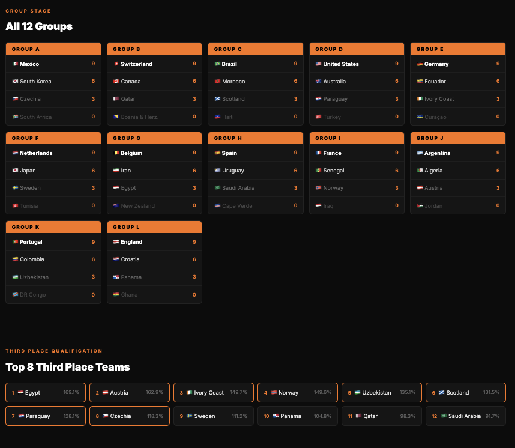
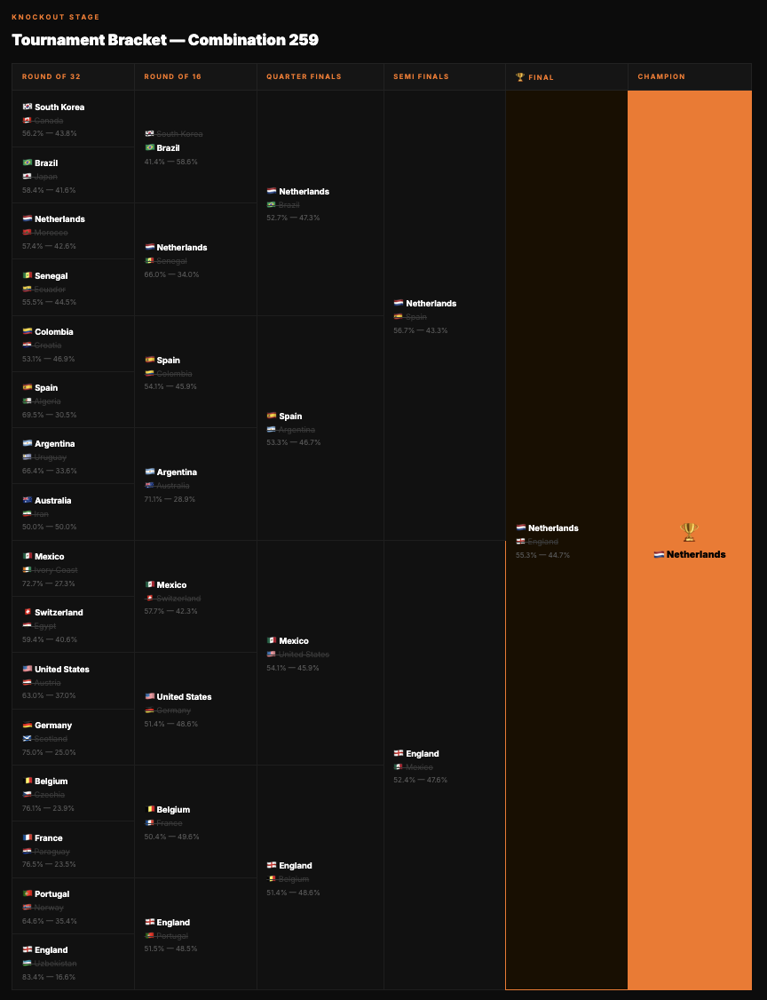

# World Cup Match Predictor

A Machine Learning model that predicts international football match outcomes using a logistical regression model trained real historical (international) match data.

---

## Overview

This project has evolved across four versions, each building on the last:

- **v1** — Hand-crafted feature model with manually assigned weights and synthetic training data. The model learned nothing real; it just replicated the assumptions baked into the weights.
- **v2** — Rebuilt from scratch using real historical match data (44,000+ international results from 1872–2026). I Also introduced a ML pipeline: rolling form calculation, 80/20 train/test split, L2-regularised logistic regression with z-score normalisation. Methodology inspired by [Kerr (2015), MIT M.Eng thesis: *Applying Machine Learning to Event Data in Soccer*].
- **v3** — A rolling goals scored and goals conceded features was added alongside win rate form.
- **v4** — An additional historical FIFA rankings dataset was merged via `merge_asof` for each team at each match date, added neutral ground flag as a binary feature, and built a prediction interface that takes two team names and outputs win probabilities for both teams.

**Final accuracy: ≈77.4%** on held-out test set (vs 60% baseline of always predicting home team wins).

---

## Features Used

| Feature | Description |
|---|---|
| `home_team_form` | Rolling win rate over last 5 games (home team) |
| `away_team_form` | Rolling win rate over last 5 games (away team) |
| `home_avg_goals_scored` | Rolling goals scored over last 5 games |
| `away_avg_goals_scored` | Rolling goals scored over last 5 games |
| `home_avg_goals_conceded` | Rolling goals conceded over last 5 games |
| `away_avg_goals_conceded` | Rolling goals conceded over last 5 games |
| `home_rank` | FIFA ranking at time of match (home team) |
| `away_rank` | FIFA ranking at time of match (away team) |
| `neutral` | Whether the match was played on neutral ground |

All features are z-score normalised before training.

---

## Data

- **Match results:** [International football results 1872–2026](https://www.kaggle.com/datasets/martj42/international-football-results-from-1872-to-2017) — Kaggle (martj42)
- **FIFA rankings:** [FIFA World Ranking 1992–2024](https://www.kaggle.com/datasets/cashncarry/fifaworldranking) — Kaggle (cashncarry), extended with June 2026 official rankings

Data is not included in the repo. To download:

```bash
kaggle datasets download martj42/international-football-results-from-1872-to-2017
kaggle datasets download cashncarry/fifaworldranking
```

Place both CSVs in a `data/` folder.

---

## Methodology

Matches are filtered to competitive internationals from 2010 onwards, taking out all non-competitive (friendly) matches. Draws are excluded for binary classification (win/loss only), consistent with the MIT thesis approach.

Form features are calculated using a rolling window over each team's past games and are sorted by date, with `.shift(1)` applied to prevent data leakage; the model only sees results that would have been available before each match.

FIFA rankings are merged using `pd.merge_asof` to match each team's most recent ranking before each match date.

The model is L2-regularised logistic regression (`sklearn.linear_model.LogisticRegression`) with `StandardScaler` normalisation, trained with `random_state=42` for reproducibility.

---

## Usage

```bash
python3 prediction-v4.py
```

```
Enter home team: Argentina
Enter away team: France
Neutral ground? (y/n): y
Argentina  win probability:  52.3 %
France  win probability:  47.7 %
```

Team names must match exactly as they appear in the results dataset (e.g. `United States` not `USA`, `Ivory Coast` not `Côte d'Ivoire`).

---

## Results

| Version | Key Change | Accuracy |
|---|---|---|
| v1 | Synthetic training data | N/A (not real) |
| v2 | Real data + rolling form | ~50% |
| v3 | + Goals scored/conceded | ~61% |
| v4 | + FIFA rankings + neutral ground | **77.4%** |

The jump from v3 to v4 confirms FIFA ranking is the strongest predictive signal — consistent with football intuition that team quality outweighs recent form over a large sample.

---

## 2026 World Cup Simulation
 
Using the trained model, all 72 group stage matches were simulated to predict the full tournament outcome.
 
| Stage | Predicted Result |
|---|---|
| Group Stage | 12 groups simulated (win/loss only, no draws) |
| Third Place | Top 8 from 12 groups via total win probability tiebreaker |
| Bracket | FIFA combination 259 (3rd place teams from groups A,C,D,E,G,I,J,K) |
| Champion | 🇳🇱 **Netherlands** (def. 🏴󠁧󠁢󠁥󠁮󠁧󠁿 England 55.3% — 44.7%) |
 
Full bracket and group tables exported to `wc2026_predictions.html`.
 
**Simulation limitations:** draws excluded (binary win/loss only), bracket hardcoded for combination 259, does not account for tournament pressure or squad rotation.

## Preview

<p align="center">
  
  
</p>

> Group stage & third place qualification (left) · Full knockout bracket to final (right)

## Requirements

```bash
pip install pandas numpy scikit-learn matplotlib seaborn kagglehub
```

---

## Limitations

- Draws are excluded - In a future iteration a multinomial logistic regression or a Poisson goals model could be used to handle all three outcomes
- Team name mismatches between datasets (e.g. `Cabo Verde` vs `Cape Verde`) require manual mapping
- Rankings dataset ends mid-2024; the June 2026 rankings were manually appended for current matches
- Model does not account for player availability, injuries, or tournament context (yet)

---

## References

- Kerr, M.G.S. (2015). *Applying Machine Learning to Event Data in Soccer*. M.Eng thesis, MIT EECS.
- FIFA/Coca-Cola Men's World Ranking — inside.fifa.com